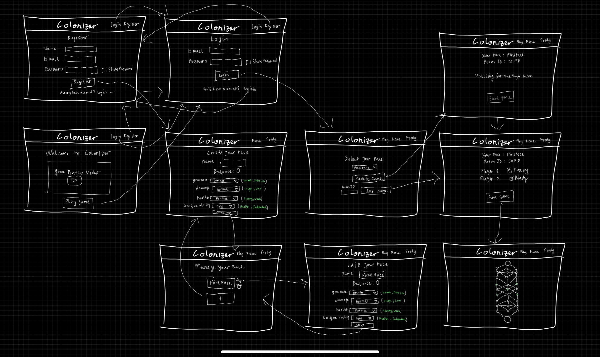
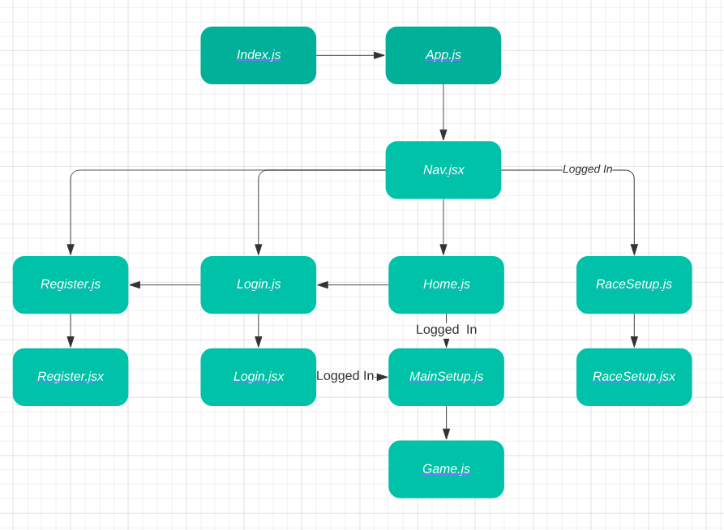

# colonizer

## Date 12/07/22
### By: [Fredy Laksmono](https://www.linkedin.com/in/fredy-laksmono/) [Github Fredy](https://github.com/fredy-laksmono)
#### [Project Trello](https://trello.com/b/MP1kDdIV/colonizer)

---

[App](https://github.com/fredy-laksmono/colonizer)

---

### Description
   
Colonizer is a real time strategy game where you try to outwit your opponent in unit management. 

***

### Technologies used

* HTML
* CSS
* PostgreSQL
* Sequelize
* Express
* React
* Node js

***

### Getting Started

***

### Photos

***

### Credits

PostgreSQL: [https://www.postgresql.org]   
Sequelize: [https://sequelize.org/]  
Express: [https://expressjs.com/]   
React:[https://reactjs.org/]   
NodeJs: [https://nodejs.org/en/]   
W3 Schools: [https://www.w3schools.com/]
Expanding Card Animation: [https://www.youtube.com/watch?v=rZ6iu5FQr2c&ab_channel=developedbyed]
Dragable HTML Element: [https://www.w3schools.com/howto/howto_js_draggable.asp]