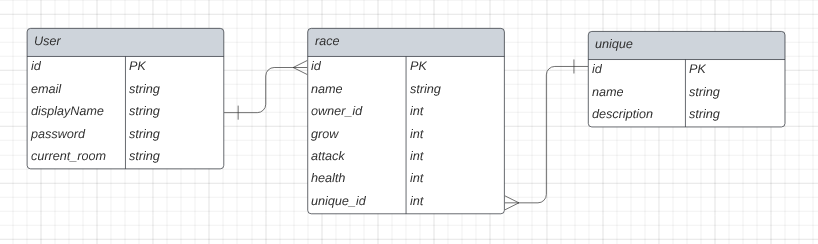

# Battleship Chaos

## Date 12/15/22
### By: [Fredy Laksmono](https://www.linkedin.com/in/fredy-laksmono/) [Github Fredy](https://github.com/fredy-laksmono)
#### [Project Trello](https://trello.com/b/MP1kDdIV/colonizer)

---

[App](https://battleship-chaos.herokuapp.com/)

---

### Description
   
Battleship Chaos is a multiplayer game battleship with chaotic rule. All players will put their ship on a shared board. Any player who put on the same board, based on the class of the ship, lower level will be destroyed. All players will select the coordinate to attack at the same time. As round go on, player attack will be upgraded.

***

### Technologies used

* HTML
* CSS
* PostgreSQL
* Sequelize
* Express
* React
* Node js
* socket.io
* framer-motion

***

### Getting Started
Go to the [Battleship Chaos](https://battleship-chaos.herokuapp.com/). First sign up for an account. 

After register, create your first race. You can have as many race you want to create. The balance power need to be on 0 before you can create your race or update it. 

Once your race created, click play and select the race you want and click create game to start as a host. You will get a randomly generate room# which you can share to your friends that want to join game session.

In lobby, you can chat while waiting for all the party members joined. 

Below steps, is still WIP.
As host, you can continue to the next phase for starting the game. At this moment, no more new player will be accepted.

You will deploy your 3 standard units and a mothership during game setup phase. Click ready. Once all players ready, game will start.

***

### Photos

***

### Credits

PostgreSQL: [https://www.postgresql.org]   
Sequelize: [https://sequelize.org/]  
Express: [https://expressjs.com/]   
React:[https://reactjs.org/]   
NodeJs: [https://nodejs.org/en/]   
Socket.io: [https://socket.io/]    
Framer-motion: [https://www.framer.com/motion/]    
W3 Schools: [https://www.w3schools.com/]    
Expanding Card Animation: [https://www.youtube.com/watch?v=rZ6iu5FQr2c&ab_channel=developedbyed]     
Dragable HTML Element: [https://www.w3schools.com/howto/howto_js_draggable.asp]     